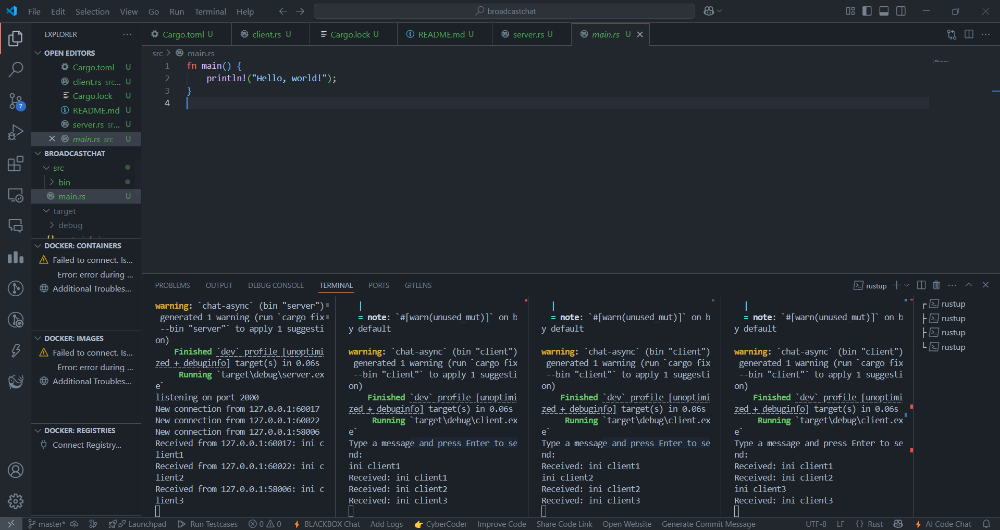

## Experiment 1.1.

This experiment demonstrates how asynchronous programming is effectively used in a real-time broadcast chat application using WebSockets in Rust. By running a server and multiple clients, we can observe how messages typed by one client are instantly received by all others, showcasing non-blocking communication. Each client handles sending and receiving concurrently using `tokio::spawn` and `tokio::select!`, ensuring smooth and responsive interaction. The server utilizes a broadcast channel to relay messages to all connected clients efficiently. This setup highlights the suitability of asynchronous programming for scenarios involving multiple simultaneous I/O operations, such as chat apps or live feeds.

