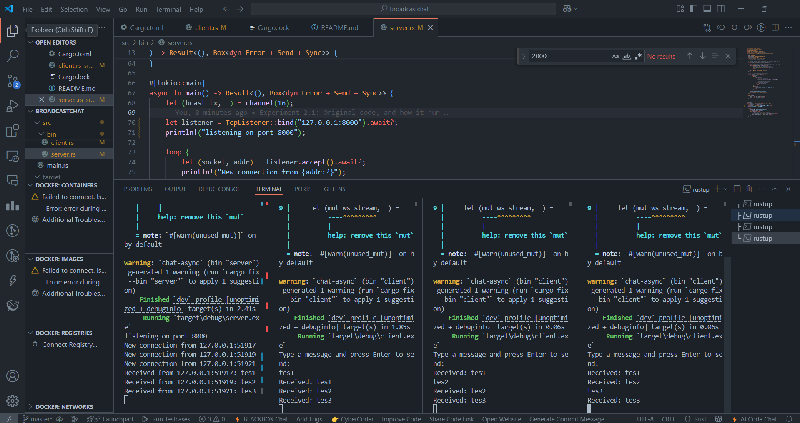
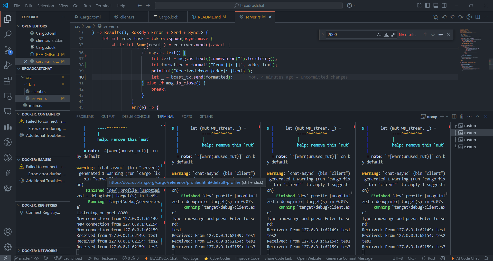

## Experiment 1.1.

This experiment demonstrates how asynchronous programming is effectively used in a real-time broadcast chat application using WebSockets in Rust. By running a server and multiple clients, we can observe how messages typed by one client are instantly received by all others, showcasing non-blocking communication. Each client handles sending and receiving concurrently using `tokio::spawn` and `tokio::select!`, ensuring smooth and responsive interaction. The server utilizes a broadcast channel to relay messages to all connected clients efficiently. This setup highlights the suitability of asynchronous programming for scenarios involving multiple simultaneous I/O operations, such as chat apps or live feeds.


## Experiment 1.2.

In this experiment, we changed the WebSocket port from the default `2000` to `8080` to better simulate how ports can be adjusted based on deployment environments. Since WebSocket communication involves both a server and a client, we had to update the port in two places. On the server side, the line `TcpListener::bind("127.0.0.1:2000")` was modified to `127.0.0.1:8080`, and on the client side, the WebSocket URI `ws://127.0.0.1:2000` was updated to `ws://127.0.0.1:8080`. This change ensures both components are trying to connect on the same port using the same WebSocket protocol. After the update, the chat application still functioned correctly, with clients able to send and receive messages just as before, confirming that the port change was successful.



## Experiment 1.3.

For this experiment, we modified the server so that every message sent includes the sender's IP address and port. This change was made by appending the sender's `SocketAddr` to each message before it is broadcast to all clients. The purpose is to allow clients to identify where each message is coming from, even though we haven’t implemented a user naming system yet. As a result, every message received by a client will be displayed in a format like “From 127.0.0.1:49123: hello”, making it easier to recognize the sender. This modification helps us understand how additional information can be embedded in asynchronous communication using WebSocket.





## Bonus


# WebSocket Chat Application

A real-time chat application built with Rust using WebSockets for instant messaging between multiple clients.

## What This Application Does

This is a distributed chat system consisting of two main components:

### 🖥️ **Server** (`chat_server`)
- Hosts a WebSocket server on `127.0.0.1:8080`
- Manages multiple concurrent client connections
- Broadcasts messages to all connected users
- Maintains a real-time list of online users
- Handles user registration and disconnection gracefully

### 💬 **Client** (`chat_client`)
- Connects to the WebSocket chat server
- Allows users to send and receive messages in real-time
- Displays online user list
- Supports custom usernames or auto-generates guest names
- Provides a command-line interface for chatting

## Features

- **Real-time messaging**: Instant message delivery to all connected clients
- **User management**: Track who's online with automatic user list updates
- **Automatic reconnection handling**: Graceful handling of connection drops
- **Guest user support**: Auto-generates usernames for anonymous users
- **JSON-based protocol**: Structured message format for reliable communication
- **Concurrent connections**: Support for multiple users chatting simultaneously

## Architecture

The application uses a broadcast channel pattern:

```
[Client 1] ←→ [WebSocket] ←→ [Server] ←→ [WebSocket] ←→ [Client 2]
                                ↕
                          [Broadcast Channel]
                                ↕
                         [WebSocket] ←→ [Client 3]
```

### Message Types

The system supports three types of messages:

1. **`register`**: User registration with chosen username
2. **`users`**: Broadcast of current online user list
3. **`message`**: Chat messages between users

### Protocol Format

Messages follow this JSON structure:
```json
{
  "messageType": "register|users|message",
  "data": "optional string data",
  "dataArray": ["optional", "array", "data"]
}
```

## How to Run

### Prerequisites
- Rust (latest stable version)
- Cargo package manager

### Running the Server
```bash
cargo run --bin server
```
The server will start on `127.0.0.1:8080` and display connection logs.

### Running the Client
```bash
# With custom username
cargo run --bin client YourUsername

# Or let it auto-generate a guest name
cargo run --bin client
```

### Usage
1. Start the server first
2. Launch one or more clients
3. Type messages and press Enter to send
4. See real-time user list updates when people join/leave
5. All messages are broadcast to every connected user

## Technical Implementation

### Server Components
- **TCP Listener**: Accepts incoming WebSocket connections
- **Broadcast Channel**: Distributes messages to all connected clients
- **User State Management**: Thread-safe HashMap tracking active sessions
- **Message Routing**: Handles different message types (register, chat, users)

### Client Components
- **Input Handler**: Reads user input from command line
- **Output Handler**: Displays incoming messages and user updates
- **WebSocket Connection**: Maintains persistent connection to server
- **Message Formatting**: Converts user input to proper JSON protocol

### Key Technologies Used
- **Tokio**: For asynchronous runtime and concurrency
- **tokio-websockets**: WebSocket implementation
- **Serde**: JSON serialization/deserialization
- **futures-util**: Stream and sink utilities for WebSocket handling

## Error Handling

The application includes robust error handling for:
- Network connection failures
- JSON parsing errors
- User disconnections
- Server shutdown scenarios
- Invalid message formats

## Scalability Considerations

- **Memory Efficient**: Uses Rust's zero-cost abstractions
- **Concurrent**: Handles multiple connections without blocking
- **Resource Management**: Automatic cleanup of disconnected users
- **Broadcast Optimization**: Single message broadcast to all clients

This chat application demonstrates practical use of WebSockets, async programming in Rust, and real-time communication patterns suitable for production-scale messaging systems.